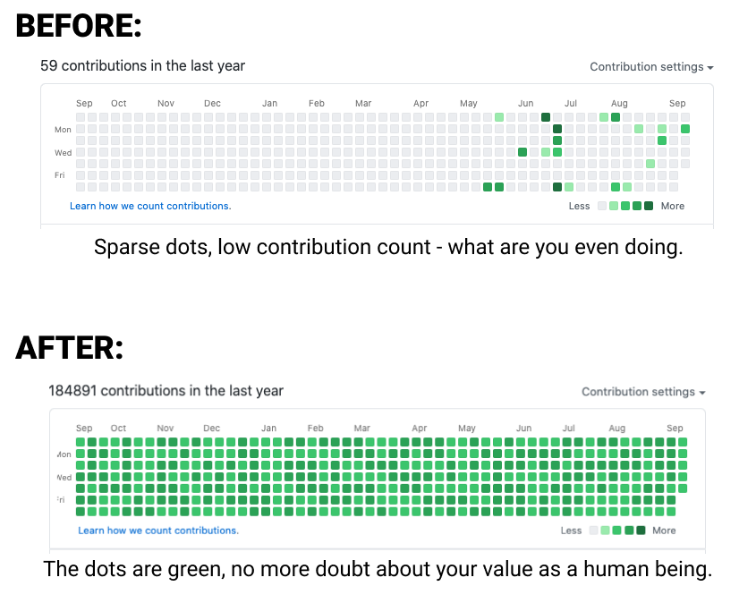

# What's Stopping You From Coding Like This

A Chrome extension that lets you unleash your inner POWER DEVELOPER.

Since we all know that the only thing that defines our values as human beings and
provides a reason for our existence is the number of version-managed commits we made
on a specific website, What's Stopping You From Coding Like This (WSYFCLT) let's you
improve your commit history so you too can be a valuable member of human society.

## How to use

1. Download the latest release.
2. Unzip to your favorite folder.
3. Go to Chrome Extensions [chrome://extensions](chrome://extensions)
4. Enable 'Developer Mode' on the top-right if you haven't yet (what kind of developer are you even??)
5. Click on 'Load Unpacked' and navigate to your favorite folder.
6. Click on the 'Extensions' icon in the extension toolbar and pin the extension to it.
7. Go to your Github.com profile - you should see a powerful purple flex icon in your extension toolbar.
8. Click it and select appropriate skill level:

9. Bask in your own glory 🤩